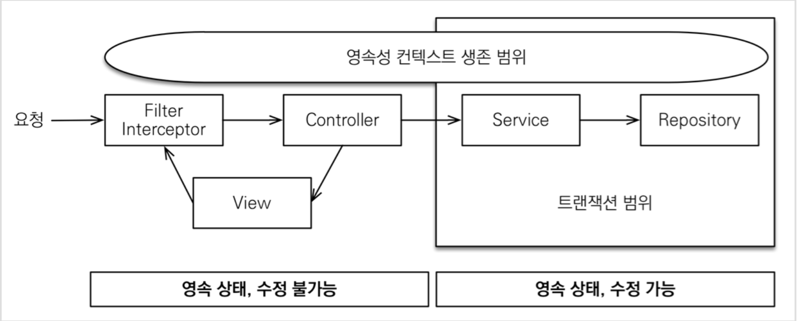
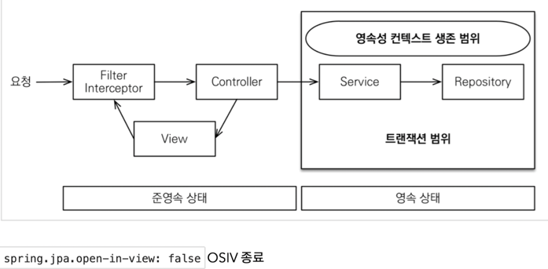

# 김영한님 "실전! 스프링 부트와 JPA 활용

## 1. 웹 애플리케이션 개발" 스터디

### **엔티티 설계시 주의점**

**엔티티에는 가급적 Setter를 사용하지 말자**

- Setter가 모두 열려있다. 변경 포인트가 너무 많아서, 유지보수가 어렵다. 나중에 리펙토링으로 Setter 제거

**모든 연관관계는 지연로딩으로 설정!**

- 즉시로딩( EAGER )은 예측이 어렵고, 어떤 SQL이 실행될지 추적하기 어렵다. 특히 JPQL을 실행할 때 N+1
  문제가 자주 발생한다.
- 실무에서 모든 연관관계는 지연로딩( LAZY )으로 설정해야 한다.
- 연관된 엔티티를 함께 DB에서 조회해야 하면, fetch join 또는 엔티티 그래프 기능을 사용한다.
- @XToOne(OneToOne, ManyToOne) 관계는 기본이 즉시로딩이므로 직접 지연로딩으로 설정해야 한다.

**컬렉션은 필드에서 초기화 하자.**

- 컬렉션은 필드에서 바로 초기화 하는 것이 안전하다.
- null 문제에서 안전하다.
- 하이버네이트는 엔티티를 영속화 할 때, 컬랙션을 감싸서 하이버네이트가 제공하는 내장 컬렉션으로 변경한다. 만약 getOrders() 처럼 임의의 메서드에서 컬력션을 잘못 생성하면 하이버네이트 내부 메커니즘에 문제가 발생할 수 있다. 따라서 필드레벨에서 생성하는 것이 가장 안전하고, 코드도 간결하다.

**테이블, 컬럼명 생성 전략**

- 스프링 부트에서 하이버네이트 기본 매핑 전략을 변경해서 실제 테이블 필드명은 다름
  - https://docs.spring.io/spring-boot/docs/2.1.3.RELEASE/reference/htmlsingle/#howto-configure-hibernate-naming-strategy
  - http://docs.jboss.org/hibernate/orm/5.4/userguide/html_single/Hibernate_User_Guide.html#naming
- 하이버네이트 기존 구현: 엔티티의 필드명을 그대로 테이블의 컬럼명으로 사용(SpringPhysicalNamingStrategy)

스프링 부트 신규 설정 (엔티티(필드) 테이블(컬럼))

1. 카멜 케이스 언더스코어(memberPoint member_point)
2. .(점) _(언더스코어)
3. 대문자 소문자

**적용 2 단계**

1. 논리명 생성: 명시적으로 컬럼, 테이블명을 직접 적지 않으면 ImplicitNamingStrategy 사용
   spring.jpa.hibernate.naming.implicit-strategy : 테이블이나, 컬럼명을 명시하지 않을 때 논리명 적용,
2. 물리명 적용:
   spring.jpa.hibernate.naming.physical-strategy : 모든 논리명에 적용됨, 실제 테이블에 적용
   (username → usernm 등으로 회사 룰로 바꿀 수 있음)

**스프링 부트 기본 설정**

```java
spring.jpa.hibernate.naming.implicit-strategy: org.springframework.boot.orm.jpa.hibernate.SpringImplicitNamingStrategy

spring.jpa.hibernate.naming.physical-strategy: org.springframework.boot.orm.jpa.hibernate.SpringPhysicalNamingStrategy
```

어노테이션

- @Repository : 스프링 빈으로 등록, JPA 예외를 스프링 기반 예외로 예외 변환
- @PersistenceContext : 엔티티 메니저( EntityManager ) 주입
- @PersistenceUnit : 엔티티 메니터 팩토리( EntityManagerFactory ) 주입
- @Transactional : 트랜잭션, 영속성 컨텍스트
  - readOnly=true : 데이터의 변경이 없는 읽기 전용 메서드에 사용, 영속성 컨텍스트를 플러시 하지 않
    으므로 약간의 성능 향상(읽기 전용에는 다 적용)
  - 데이터베이스 드라이버가 지원하면 DB에서 성능 향상
- @Autowired
  - 생성자 Injection 많이 사용, 생성자가 하나면 생략 가능
  - 스프링 필드 주입 대신에 생성자 주입을 사용하자.
    - 변경 불가능한 안전한 객체 생성 가능
    - final 키워드를 추가하면 컴파일 시점에 memberRepository 를 설정하지 않는 오류를 체크할 수 있다. (보통 기본 생성자를 추가할 때 발견)
    - 스프링 데이터 JPA를 사용하면 EntityManager 도 주입 가능
- @RunWith(SpringRunner.class) : 스프링과 테스트 통합
- @SpringBootTest : 스프링 부트 띄우고 테스트(이게 없으면 @Autowired 다 실패)
- @Transactional : 반복 가능한 테스트 지원, 각각의 테스트를 실행할 때마다 트랜잭션을 시작하고 **테스트가 끝나면 트랜잭션을 강제로 롤백** (이 어노테이션이 테스트 케이스에서 사용될 때만 롤백)

참고: 테스트 케이스 작성 고수 되는 마법: Given, When, Then ([http://martinfowler.com/bliki/GivenWhenThen.html](http://martinfowler.com/bliki/GivenWhenThen.html))

**테스트 케이스를 위한 설정**

테스트는 케이스 격리된 환경에서 실행하고, 끝나면 데이터를 초기화하는 것이 좋다. 그런 면에서 메모리
DB를 사용하는 것이 가장 이상적이다.
추가로 테스트 케이스를 위한 스프링 환경과, 일반적으로 애플리케이션을 실행하는 환경은 보통 다르므로
설정 파일을 다르게 사용하자.

다음과 같이 간단하게 테스트용 설정 파일을 추가하면 된다.

test/resources/application.yml

```yaml
spring:
#  datasource:
#    url: jdbc:h2:mem:testdb
#    username: sa
#    password:
#    driver-class-name: org.h2.Driver
#  jpa:
#    hibernate:
#      ddl-auto: create
#    properties:
#      hibernate:
#        show_sql: true
#        format_sql: true
#    open-in-view: false

logging.level:
org.hibernate.SQL: debug
#  org.hibernate.type: trace
```

테스트에서 스프링을 실행하면 test/resource/application.yaml 위치에 있는 설정 파일을 읽는다. (만약 이 위치에 없으면 src/resources/application.yml 을 읽는다.)
스프링 부트는 datasource 설정이 없으면, 기본적으로 메모리 DB를 사용하고, driver-class도 현재 등록된 라이브러를 보고 찾아준다. 추가로 ddl-auto 도 create-drop 모드로 동작한다. 따라서 데이터소스나, JPA 관련된 별도의 추가 설정을 하지 않아도 된다.

### 비지니스 로직

주문 서비스의 주문과 주문 취소 메서드를 보면 비즈니스 로직 대부분이 엔티티에 있다.

서비스 계층 은 단순히 엔티티에 필요한 요청을 위임하는 역할을 한다. 이처럼 엔티티가 비즈니스 로직을 가지고 객체 지 향의 특성을 적극 활용하는 것을 **도메인 모델 패턴**([http://martinfowler.com/eaaCatalog/domainModel.html](http://martinfowler.com/eaaCatalog/domainModel.html))이라 한다.

반대로 엔티티에는 비즈니스 로직이 거의 없고 서비스 계층에서 대부분 의 비즈니스 로직을 처리하는 것을 트랜잭션 스크립트 패턴([http://martinfowler.com/eaaCatalog/transactionScript.html](http://martinfowler.com/eaaCatalog/transactionScript.html))이라 한다.

### 동적 쿼리

JPA Criteria는 JPA 표준 스펙이지만 실무에서 사용하기에 너무 복잡하다. 결국 다른 대안이 필요하다. 많 은 개발자가 비슷한 고민을 했지만, 가장 멋진 해결책은 Querydsl이 제시했다. Querydsl 소개장에서 간 단히 언급하겠다. 지금은 이대로 진행하자.

### 스프링 부트 타임리프 기본 설정

```yaml
spring:
  thymeleaf:
    prefix: classpath:/templates/
    suffix: .html
```

### 폼 객체 vs 엔티티 직접 사용

참고: 요구사항이 정말 단순할 때는 폼 객체( MemberForm ) 없이 엔티티( Member )를 직접 등록과 수정 화면에서 사용해도 된다. 하지만 화면 요구사항이 복잡해지기 시작하면, 엔티티에 화면을 처리하기 위한 기능이
점점 증가한다. 결과적으로 엔티티는 점점 화면에 종속적으로 변하고, 이렇게 화면 기능 때문에 지저분해진
엔티티는 결국 유지보수하기 어려워진다.

실무에서 **엔티티는 핵심 비즈니스 로직만 가지고 있고, 화면을 위한 로직은 없어야 한다**. 화면이나 API에 맞
는 폼 객체나 DTO를 사용하자. 그래서 화면이나 API 요구사항을 이것들로 처리하고, 엔티티는 최대한 순수
하게 유지하자.

### **변경 감지와 병합(merge)**

**준영속 엔티티?**
영속성 컨텍스트가 더는 관리하지 않는 엔티티를 말한다.
(여기서는 itemService.saveItem(book) 에서 수정을 시도하는 Book 객체다. Book 객체는 이미 DB 에 한번 저장되어서 식별자가 존재한다. 이렇게 임의로 만들어낸 엔티티도 기존 식별자를 가지고 있으면 준영속 엔티티로 볼 수 있다.)

**준영속 엔티티를 수정하는 2가지 방법**

- 변경 감지 기능 사용
  - 영속성 컨텍스트에서 엔티티를 다시 조회한 후에 데이터를 수정하는 방법
    트랜잭션 안에서 엔티티를 다시 조회, 변경할 값 선택 → 트랜잭션 커밋 시점에 변경 감지(Dirty Checking)
    이 동작해서 데이터베이스에 UPDATE SQL 실행
- 병합( merge ) 사용
  - 병합은 준영속 상태의 엔티티를 영속 상태로 변경할 때 사용하는 기능이다.
  - 동작 방식
    1. merge()를실행한다.
    2. 파라미터로 넘어온 준영속 엔티티의 식별자 값으로 1차 캐시에서 엔티티를 조회한다.
      1. 만약 1차 캐시에 엔티티가 없으면 데이터베이스에서 엔티티를 조회하고, 1차 캐시에 저장한다.
    3. 조회한 영속 엔티티( mergeMember )에 member 엔티티의 값을 채워 넣는다. (member 엔티티의 모든 값을 mergeMember에 밀어 넣는다. 이때 mergeMember의 “회원1”이라는 이름이 “회원명변경”으로 바뀐다.)
    4. 영속 상태인 mergeMember를 반환한다.
  - 간단 정리
    1. 준영속 엔티티의 식별자 값으로 영속 엔티티를 조회한다.
    2. 영속 엔티티의 값을 준영속 엔티티의 값으로 모두 교체한다.(병합한다.)
    3. 트랜잭션 커밋 시점에 변경 감지 기능이 동작해서 데이터베이스에 UPDATE SQL이 실행

  > 주의: 변경 감지 기능을 사용하면 원하는 속성만 선택해서 변경할 수 있지만, 병합을 사용하면 모든 속성이 변경된다. 병합시 값이 없으면 null 로 업데이트 할 위험도 있다. (병합은 모든 필드를 교체한다.)
  >

  ```java
  Item mergedItem = em.merge(item);
  // item 은 merge 메서드에 넣어줘도 영속성 컨텍스트에서 관리하지 않는다.
  // em.merge() 의 반환 엔티티가 영속성 컨텍스트에서 관리된다.
  ```

- 가급적 머지를 사용하지 말자.

**새로운 엔티티 저장과 준영속 엔티티 병합을 편리하게 한번에 처리**

상품 리포지토리에선 save() 메서드를 유심히 봐야 하는데, 이 메서드 하나로 저장과 수정(병합)을 다 처리한다. 코드를 보면 식별자 값이 없으면 새로운 엔티티로 판단해서 persist() 로 영속화하고 만약 식별자 값이 있으면 이미 한번 영속화 되었던 엔티티로 판단해서 merge() 로 수정(병합)한다. 결국 여기서의 저장 (save)이라는 의미는 신규 데이터를 저장하는 것뿐만 아니라 변경된 데이터의 저장이라는 의미도 포함한다. 이렇게 함으로써 이 메서드를 사용하는 클라이언트는 저장과 수정을 구분하지 않아도 되므로 클라이언트의 로직이 단순해진다.
여기서 사용하는 수정(병합)은 준영속 상태의 엔티티를 수정할 때 사용한다. 영속 상태의 엔티티는 변경 감 지(dirty checking)기능이 동작해서 트랜잭션을 커밋할 때 자동으로 수정되므로 별도의 수정 메서드를 호 출할 필요가 없고 그런 메서드도 없다.

참고: save() 메서드는 식별자를 자동 생성해야 정상 동작한다. 여기서 사용한 Item 엔티티의 식별자는 자동으로 생성되도록 @GeneratedValue 를 선언했다. 따라서 식별자 없이 save() 메서드를 호출하면 persist() 가 호출되면서 식별자 값이 자동으로 할당된다. 반면에 식별자를 직접 할당하도록 @Id 만 선언 했다고 가정하자. 이 경우 식별자를 직접 할당하지 않고, save() 메서드를 호출하면 식별자가 없는 상태로 persist() 를 호출한다. 그러면 식별자가 없다는 예외가 발생한다.

참고: 실무에서는 보통 업데이트 기능이 매우 재한적이다. 그런데 병합은 모든 필드를 변경해버리고, 데이터 가 없으면 null 로 업데이트 해버린다. 병합을 사용하면서 이 문제를 해결하려면, 변경 폼 화면에서 모든 데이터를 항상 유지해야 한다. 실무에서는 보통 변경가능한 데이터만 노출하기 때문에, 병합을 사용하는 것이 오히려 번거롭다.

### **엔티티를 변경할 때는 항상 변경 감지를 사용하세요**

- 컨트롤러에서 어설프게 엔티티를 생성하지 마세요.
- 트랜잭션이 있는 서비스 계층에 식별자( id )와 변경할 데이터를 명확하게 전달하세요.(파라미터 or dto)
- 트랜잭션이 있는 서비스 계층에서 영속 상태의 엔티티를 조회하고, 엔티티의 데이터를 직접 변경하세요.
- 트랜잭션 커밋 시점에 변경 감지가 실행됩니다.

## 2. API 개발과 성능 최적화

API 요청 스펙에 맞추어 별도의 DTO를 파라미터로 받는다.

**엔티티 대신에 DTO를 RequestBody에 매핑**

- CreateMemberRequest 를 Member 엔티티 대신에 RequestBody와 매핑한다.
- 엔티티와 프레젠테이션 계층을 위한 로직을 분리할 수 있다.
- 엔티티와 API 스펙을 명확하게 분리할 수 있다.
- 엔티티가 변해도 API 스펙이 변하지 않는다.

실무에서는 엔티티를 API 스펙에 노출하면 안된다!

- 회원 수정 API updateMemberV2 은 회원 정보를 부분 업데이트 한다. 여기서 PUT 방식을 사용했는데, PUT은 전체 업데이트를 할 때 사용하는 것이 맞다. 부분 업데이트를 하려면 PATCH를 사용하거나 POST를 사용하는 것이 REST 스타일에 맞다.

엔티티를 외부에 노출하지 마세요!

- 실무에서는 member 엔티티의 데이터가 필요한 API가 계속 증가하게 된다. 어떤 API는 name 필드가 필요하지만, 어떤 API는 name 필드가 필요없을 수 있다. 결론적으로 엔티티 대신에 API 스펙에 맞는 별도의 DTO를 노출해야 한다.

**응답 값으로 엔티티가 아닌 별도의 DTO 사용**

- 엔티티를 DTO로 변환해서 반환한다.
- 엔티티가 변해도 API 스펙이 변경되지 않는다.
- 추가로 Result 클래스로 컬렉션을 감싸서 향후 필요한 필드를 추가할 수 있다.

  ```java
  @RequireArgsConstructor
  @Getter
  public class Result<T> {
    private final T data;
  }
  ```


### API 스팩에 맞는 DTO를 만들어서 요청 받고, 응답 해라!

### **API 개발 고급 - 지연 로딩과 조회 성능 최적화**

1. **간단한 주문 조회 V1: 엔티티를 직접 노출**

   엔티티를 직접 노출할 때는 양방향 연관관계가 걸린 곳은 꼭! 한곳을 @JsonIgnore 처리 해야 한다.
   안그러면 양쪽을 서로 호출하면서 무한 루프가 걸린다.

   엔티티를 직접 노출하는 것은 좋지 않다. (앞장에서 이미 설명)
   order member 와 order address 는 지연 로딩이다. 따라서 실제 엔티티 대신에 프록시 존재

   jackson 라이브러리는 기본적으로 이 프록시 객체를 json으로 어떻게 생성해야 하는지 모름
   Hibernate5Module 을 스프링 빈으로 등록하면 해결(스프링 부트 사용중)

   **Hibernate5Module 등록**
   JpashopApplication 에 다음 코드를 추가하자

  ```java
  @Bean
  Hibernate5Module hibernate5Module() {
      return new Hibernate5Module();
  }
  ```

   기본적으로 초기화 된 프록시 객체만 노출, 초기화 되지 않은 프록시 객체는 노출 안함
   참고: build.gradle 에 다음 라이브러리를 추가하자

   implementation 'com.fasterxml.jackson.datatype:jackson-datatype-hibernate5'

   **다음과 같이 설정하면 강제로 지연 로딩 가능**

  ```java
  @Bean
  Hibernate5Module hibernate5Module() {
      Hibernate5Module hibernate5Module = new Hibernate5Module();
      //강제 지연 로딩 설정
      hibernate5Module.configure(Hibernate5Module.Feature.FORCE_LAZY_LOADING, true);
      return hibernate5Module;
  }
  // 이 옵션을 키면 order -> member , member -> orders 양방향 연관관계를 계속 로딩하게 된다. 따라서 @JsonIgnore 옵션을 한곳에 주어야 한다.
  ```

   > 주의: 엔티티를 직접 노출할 때는 양방향 연관관계가 걸린 곳은 꼭! 한곳을 @JsonIgnore 처리 해야 한다. 안그러면 양쪽을 서로 호출하면서 무한 루프가 걸린다.
   >

   > 참고: 앞에서 계속 강조했듯이 정말 간단한 애플리케이션이 아니면 엔티티를 API 응답으로 외부로 노출하는 것은 좋지 않다. 따라서 Hibernate5Module 를 사용하기 보다는 DTO로 변환해서 반환하는 것이 더 좋은 방법이다.
   >

   > 주의: 지연 로딩(LAZY)을 피하기 위해 즉시 로딩(EARGR)으로 설정하면 안된다! 즉시 로딩 때문에
   연관관계가 필요 없는 경우에도 데이터를 항상 조회해서 성능 문제가 발생할 수 있다. 즉시 로딩으로
   설정하면 성능 튜닝이 매우 어려워 진다.
   >
   >
   > 항상 지연 로딩을 기본으로 하고, 성능 최적화가 필요한 경우에는 페치 조인(fetch join)을 사용해라!(V3에서 설명)
>
2. **간단한 주문 조회 V2: 엔티티를 DTO로 변환**
  - 엔티티를 DTO로 변환하는 일반적인 방법이다.
  - 쿼리가 총 1 + N + N번 실행된다. (v1과 쿼리수 결과는 같다.)
    - order 조회 1번(order 조회 결과 수가 N이 된다.)
    - order -> member 지연 로딩 조회 N 번
    - order -> delivery 지연 로딩 조회 N 번
    - 예) order의 결과가 4개면 최악의 경우 1 + 4 + 4번 실행된다.(최악의 경우)
      - 지연로딩은 영속성 컨텍스트에서 조회하므로, 이미 조회된 경우 쿼리를 생략한다.
3. **간단한 주문 조회 V3: 엔티티를 DTO로 변환 - 페치 조인 최적화**

   엔티티를 페치 조인(fetch join)을 사용해서 쿼리 1번에 조회
   페치 조인으로 order -> member , order -> delivery 는 이미 조회 된 상태 이므로 지연로딩X

4. **간단한 주문 조회 V4: JPA에서 DTO로 바로 조회**

   일반적인 SQL을 사용할 때 처럼 원하는 값을 선택해서 조회
   new 명령어를 사용해서 JPQL의 결과를 DTO로 즉시 변환
   SELECT 절에서 원하는 데이터를 직접 선택하므로 DB 애플리케이션 네트웍 용량 최적화(생각보다 미비)
   리포지토리 재사용성 떨어짐, API 스펙에 맞춘 코드가 리포지토리에 들어가는 단점


**정리**

엔티티를 DTO로 변환하거나, DTO로 바로 조회하는 두가지 방법은 각각 장단점이 있다. 둘중 상황에
따라서 더 나은 방법을 선택하면 된다. 엔티티로 조회하면 리포지토리 재사용성도 좋고, 개발도 단순해진다.
따라서 권장하는 방법은 다음과 같다.

**쿼리 방식 선택 권장 순서**

1. 우선 엔티티를 DTO로 변환하는 방법을 선택한다.
2. **필요하면 페치 조인으로 성능을 최적화 한다. 대부분의 성능 이슈가 해결된다.**
3. 그래도 안되면 DTO로 직접 조회하는 방법을 사용한다.
4. 최후의 방법은 JPA가 제공하는 네이티브 SQL이나 스프링 JDBC Template을 사용해서 SQL을 직접 사용한다.

### **API 개발 고급 - 컬렉션 조회 최적화**

앞의 예제에서는 toOne(OneToOne, ManyToOne) 관계만 있었다. 이번에는 컬렉션인 일대다 관계(OneToMany)를 조회하고, 최적화하는 방법을 알아보자.

1. **엔티티 직접 노출**

   orderItem , item 관계를 직접 초기화하면 Hibernate5Module 설정에 의해 엔티티를 JSON으로 생성한다.
   양방향 연관관계면 무한 루프에 걸리지 않게 한곳에 @JsonIgnore 를 추가해야 한다.
   엔티티를 직접 노출하므로 좋은 방법은 아니다.

2. **엔티티를 DTO로 변환**

   지연 로딩으로 너무 많은 SQL 실행

   SQL 실행 수
   order 1번
   member , address N번(order 조회 수 만큼)
   orderItem N번(order 조회 수 만큼)
   item N번(orderItem 조회 수 만큼)

3. **엔티티를 DTO로 변환 - 페치 조인 최적화**

   페치 조인으로 SQL이 1번만 실행됨
   distinct 를 사용한 이유는 1대다 조인이 있으므로 데이터베이스 row가 증가한다. 그 결과 같은 order 엔티티의 조회 수도 증가하게 된다. JPA의 distinct는 SQL에 distinct를 추가하고, 더해서 같은 엔티티가 조회되면, 애플리케이션에서 중복을 걸러준다. 이 예에서 order가 컬렉션 페치 조인 때문에 중복 조회 되는 것을 막아준다.

   단점
   페이징 불가능

  - 참고: 컬렉션 페치 조인을 사용하면 페이징이 불가능하다. 하이버네이트는 경고 로그를 남기면서 모든 데이터를 DB에서 읽어오고, 메모리에서 페이징 해버린다(매우 위험하다). 자세한 내용은 자바 ORM 표준 JPA 프로그래밍의 페치 조인 부분을 참고하자.
  - 참고: 컬렉션 페치 조인은 1개만 사용할 수 있다. 컬렉션 둘 이상에 페치 조인을 사용하면 안된다. 데이터가 부정합하게 조회될 수 있다. 자세한 내용은 자바 ORM 표준 JPA 프로그래밍을 참고하자.

3-1. **엔티티를 DTO로 변환 - 페이징과 한계 돌파**

- 컬렉션을 페치 조인하면 페이징이 불가능하다.
  - 컬렉션을 페치 조인하면 일대다 조인이 발생하므로 데이터가 예측할 수 없이 증가한다.
  - 일다대에서 일(1)을 기준으로 페이징을 하는 것이 목적이다. 그런데 데이터는 다(N)를 기준으로 row가 생성된다.
  - Order를 기준으로 페이징 하고 싶은데, 다(N)인 OrderItem을 조인하면 OrderItem이 기준이 되어버린다.
  - (더 자세한 내용은 자바 ORM 표준 JPA 프로그래밍 - 페치 조인 한계 참조)
- 이 경우 하이버네이트는 경고 로그를 남기고 모든 DB 데이터를 읽어서 메모리에서 페이징을 시도한다.
  최악의 경우 장애로 이어질 수 있다.
- 해결 방법
  - 먼저 **ToOne**(OneToOne, ManyToOne) 관계를 모두 페치조인 한다. ToOne 관계는 row수를
    증가시키지 않으므로 페이징 쿼리에 영향을 주지 않는다.
  - 컬렉션은 지연 로딩으로 조회한다.
  - 지연 로딩 성능 최적화를 위해 hibernate.default_batch_fetch_size, @BatchSize 를 적용한다.
    - hibernate.default_batch_fetch_size: 글로벌 설정
    - @BatchSize: 개별 최적화
    - 이 옵션을 사용하면 컬렉션이나, 프록시 객체를 한꺼번에 설정한 size 만큼 IN 쿼리로 조회한다.
  - 장점
    - 쿼리 호출 수가 1+N → 1+1로 최적화 된다.
    - 조인보다 DB 데이터 전송량이 최적화 된다. (Order와 OrderItem을 조인하면 Order가 OrderItem 만큼 중복해서 조회된다. 이 방법은 각각 조회하므로 전송해야할 중복 데이터가 없다.)
    - 페치 조인 방식과 비교해서 쿼리 호출 수가 약간 증가하지만, DB 데이터 전송량이 감소한다.
    - 컬렉션 페치 조인은 페이징이 불가능 하지만 이 방법은 페이징이 가능하다.
  - 결론
    - ToOne 관계는 페치 조인해도 페이징에 영향을 주지 않는다. 따라서 ToOne 관계는 페치조인으로
      쿼리 수를 줄이고 해결하고, 나머지는 hibernate.default_batch_fetch_size 로 최적화 하자.

  > 참고: default_batch_fetch_size 의 크기는 적당한 사이즈를 골라야 하는데, 100~1000 사이를 선택하는 것을 권장한다. 이 전략을 SQL IN 절을 사용하는데, 데이터베이스에 따라 IN 절 파라미터를 1000으로 제한하기도 한다. 1000으로 잡으면 한번에 1000개를 DB에서 애플리케이션에 불러오므로 DB 에 순간 부하가 증가할 수 있다. 하지만 애플리케이션은 100이든 1000이든 결국 전체 데이터를 로딩해야 하므로 메모리 사용량이 같다. 1000으로 설정하는 것이 성능상 가장 좋지만, 결국 DB든 애플리케이션이든 순간 부하를 어디까지 견딜 수 있는지로 결정하면 된다.

1. **JPA에서 DTO 직접 조회**

   Query: 루트 1번, 컬렉션 N 번 실행
   ToOne(N:1, 1:1) 관계들을 먼저 조회하고, ToMany(1:N) 관계는 각각 별도로 처리한다.

   이런 방식을 선택한 이유는 다음과 같다.
   ToOne 관계는 조인해도 데이터 row 수가 증가하지 않는다.
   ToMany(1:N) 관계는 조인하면 row 수가 증가한다.

   row 수가 증가하지 않는 ToOne 관계는 조인으로 최적화 하기 쉬우므로 한번에 조회하고, ToMany
   관계는 최적화 하기 어려우므로 findOrderItems() 같은 별도의 메서드로 조회한다.

2. **JPA에서 DTO 직접 조회 - 컬렉션 조회 최적화**

   Query: 루트 1번, 컬렉션 1번
   ToOne 관계들을 먼저 조회하고, 여기서 얻은 식별자 orderId로 ToMany 관계인 OrderItem 을 한꺼번에 조회
   MAP을 사용해서 매칭 성능 향상(O(1))

3. **JPA에서 DTO로 직접 조회, 플랫 데이터 최적화**

   Query: 1번

   단점

   쿼리는 한번이지만 조인으로 인해 DB에서 애플리케이션에 전달하는 데이터에 중복 데이터가
   추가되므로 상황에 따라 V5 보다 더 느릴 수 도 있다.
   애플리케이션에서 추가 작업이 크다.

   페이징 불가능


**API 개발 고급 정리**

- 엔티티 조회
  - 엔티티를 조회해서 그대로 반환: V1
  - 엔티티 조회 후 DTO로 변환: V2
  - 페치 조인으로 쿼리 수 최적화: V3
  - **컬렉션 페이징과 한계 돌파: V3.1**
    - **컬렉션은 페치 조인시 페이징이 불가능**
    - **ToOne 관계는 페치 조인으로 쿼리 수 최적화**
    - **컬렉션은 페치 조인 대신에 지연 로딩을 유지하고, hibernate.default_batch_fetch_size, @BatchSize 로 최적화**
- DTO 직접 조회
  - JPA에서 DTO를 직접 조회: V4
  - **컬렉션 조회 최적화 - 일대다 관계인 컬렉션은 IN 절을 활용해서 메모리에 미리 조회해서 최적화: V5**
  - 플랫 데이터 최적화 - JOIN 결과를 그대로 조회 후 애플리케이션에서 원하는 모양으로 직접 변환: V6

**권장 순서**

1. 엔티티 조회 방식으로 우선 접근
  1. 페치조인으로 쿼리 수를 최적화
  2. 컬렉션 최적화
    1. 페이징 필요 hibernate.default_batch_fetch_size, @BatchSize 로 최적화
    2. 페이징 필요X → 페치 조인 사용
2. 엔티티 조회 방식으로 해결이 안되면 DTO 조회 방식 사용
3. DTO 조회 방식으로 해결이 안되면 NativeSQL or 스프링 JdbcTemplate

> 참고: 엔티티 조회 방식은 페치 조인이나, hibernate.default_batch_fetch_size , @BatchSize 같이 코드를 거의 수정하지 않고, 옵션만 약간 변경해서, 다양한 성능 최적화를 시도할 수 있다. 반면에 DTO를 직접 조회하는 방식은 성능을 최적화 하거나 성능 최적화 방식을 변경할 때 많은 코드를 변경해야 한다.
>

> 참고: 개발자는 성능 최적화와 코드 복잡도 사이에서 줄타기를 해야 한다. 항상 그런 것은 아니지만, 보통 성능 최적화는 단순한 코드를 복잡한 코드로 몰고간다.
엔티티 조회 방식은 JPA가 많은 부분을 최적화 해주기 때문에, 단순한 코드를 유지하면서, 성능을 최적화 할 수 있다.
반면에 DTO 조회 방식은 SQL을 직접 다루는 것과 유사하기 때문에, 둘 사이에 줄타기를 해야 한다.
>

**DTO 조회 방식의 선택지**

- DTO로 조회하는 방법도 각각 장단이 있다. V4, V5, V6에서 단순하게 쿼리가 1번 실행된다고 V6이 항상
  좋은 방법인 것은 아니다.
- V4는 코드가 단순하다. 특정 주문 한건만 조회하면 이 방식을 사용해도 성능이 잘 나온다. 예를 들어서 조회한 Order 데이터가 1건이면 OrderItem을 찾기 위한 쿼리도 1번만 실행하면 된다.
- V5는 코드가 복잡하다. 여러 주문을 한꺼번에 조회하는 경우에는 V4 대신에 이것을 최적화한 V5 방식을 사용해야 한다. 예를 들어서 조회한 Order 데이터가 1000건인데, V4 방식을 그대로 사용하면, 쿼리가 총 1 + 1000번 실행된다. 여기서 1은 Order 를 조회한 쿼리고, 1000은 조회된 Order의 row 수다. V5 방식으로 최적화 하면 쿼리가 총 1 + 1번만 실행된다. 상황에 따라 다르겠지만 운영 환경에서 100배 이상의 성능 차이가 날 수 있다.
- V6는 완전히 다른 접근방식이다. 쿼리 한번으로 최적화 되어서 상당히 좋아보이지만, Order를 기준으로 페이징이 불가능하다. 실무에서는 이정도 데이터면 수백이나, 수천건 단위로 페이징 처리가 꼭 필요하므로, 이 경우 선택하기 어려운 방법이다. 그리고 데이터가 많으면 중복 전송이 증가해서 V5와 비교해서 성능 차이도 미비하다.

### OSIV와 성능 최적화

- Open Session In View: 하이버네이트
- Open EntityManager In View: JPA (관례상 OSIV라 한다.)

spring.jpa.open-in-view: true 기본값

WARN 9118 --- [ main] JpaBaseConfiguration$JpaWebConfiguration : spring.jpa.open-in-view is enabled by default. Therefore, database queries may be performed during view rendering. Explicitly configure spring.jpa.open-in-view to disable this warning

이 기본값을 뿌리면서 애플리케이션 시작 시점에 warn 로그를 남기는 것은 이유가 있다.
OSIV 전략은 트랜잭션 시작처럼 최초 데이터베이스 커넥션 시작 시점부터 API 응답이 끝날 때 까지 영속성 컨텍스트와 데이터베이스 커넥션을 유지한다. 그래서 지금까지 View Template이나 API 컨트롤러에서 지연 로딩이 가능했던 것이다.

지연 로딩은 영속성 컨텍스트가 살아있어야 가능하고, 영속성 컨텍스트는 기본적으로 데이터베이스 커넥션을 유지한다. 이것 자체가 큰 장점이다.

**OSIV ON**



그런데 이 전략은 너무 오랜시간동안 데이터베이스 커넥션 리소스를 사용하기 때문에, 실시간 트래픽이 중요한 애플리케이션에서는 커넥션이 모자랄 수 있다. 이것은 결국 장애로 이어진다.
예를 들어서 컨트롤러에서 외부 API를 호출하면 외부 API 대기 시간 만큼 커넥션 리소스를 반환하지 못하고, 유지해야 한다.

**OSIV OFF**



OSIV를 끄면 트랜잭션을 종료할 때 영속성 컨텍스트를 닫고, 데이터베이스 커넥션도 반환한다. 따라서 커넥션 리소스를 낭비하지 않는다.
OSIV를 끄면 모든 지연로딩을 트랜잭션 안에서 처리해야 한다. 따라서 지금까지 작성한 많은 지연 로딩 코드를 트랜잭션 안으로 넣어야 하는 단점이 있다. 그리고 view template에서 지연로딩이 동작하지 않는다. 결론적으로 트랜잭션이 끝나기 전에 지연 로딩을 강제로 호출해 두어야 한다.

**커멘드와 쿼리 분리**

실무에서 **OSIV를 끈 상태**로 복잡성을 관리하는 좋은 방법이 있다. 바로 Command와 Query를 분리하는 것이다.
참고: https://en.wikipedia.org/wiki/Command–query_separation

보통 비즈니스 로직은 특정 엔티티 몇게를 등록하거나 수정하는 것이므로 성능이 크게 문제가 되지 않는다.
그런데 복잡한 화면을 출력하기 위한 쿼리는 화면에 맞추어 성능을 최적화 하는 것이 중요하다. 하지만 그 복잡성에 비해 핵심 비즈니스에 큰 영향을 주는 것은 아니다.
그래서 크고 복잡한 애플리케이션을 개발한다면, 이 둘의 관심사를 명확하게 분리하는 선택은 유지보수 관점에서 충분히 의미 있다.

단순하게 설명해서 다음처럼 분리하는 것이다.

OrderService

OrderService: 핵심 비즈니스 로직
OrderQueryService: 화면이나 API에 맞춘 서비스 (주로 읽기 전용 트랜잭션 사용)

보통 서비스 계층에서 트랜잭션을 유지한다. 두 서비스 모두 트랜잭션을 유지하면서 지연 로딩을 사용할 수 있다.

> **참고**: 필자는 고객 서비스의 실시간 API는 OSIV를 끄고, ADMIN 처럼 커넥션을 많이 사용하지 않는 곳에서는 OSIV를 켠다.
